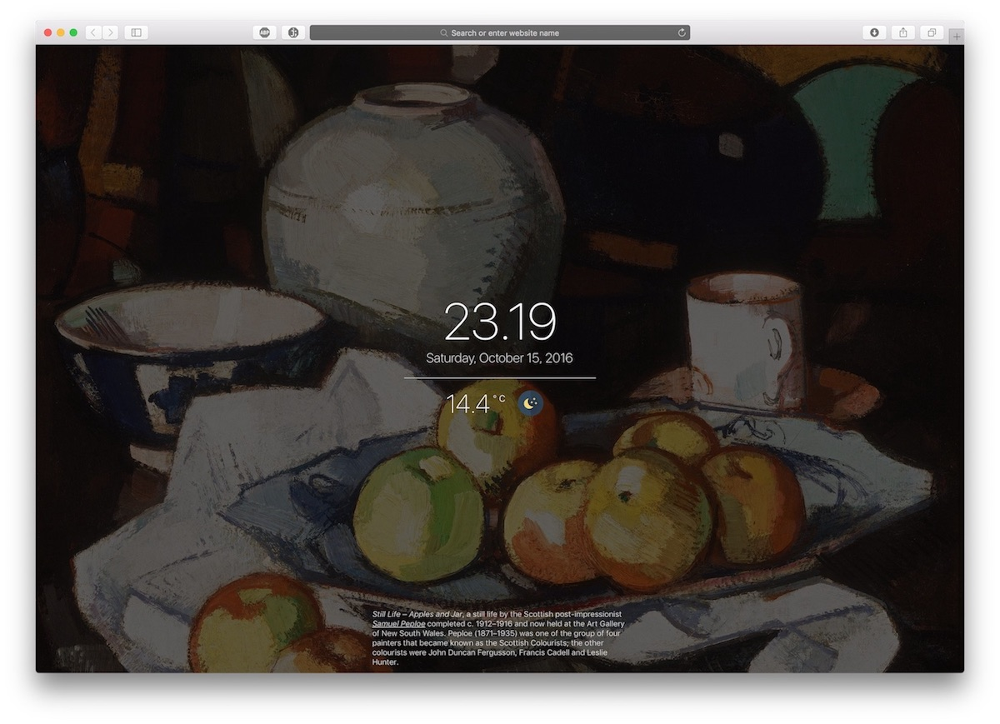

## Codsworth

Codsworth is an extremely lightweight ambient wallpaper app.

  

It works well on an unused screen or as a browser homepage (it's what I use it for!).

It currently displays the date, time, weather, and Wikipedia's picture of the day with a little blurb about it.

Simply click on the date, time, etc to cycle between preferences.

Codsworth will periodically update itself.

It works offline.

That's all.
